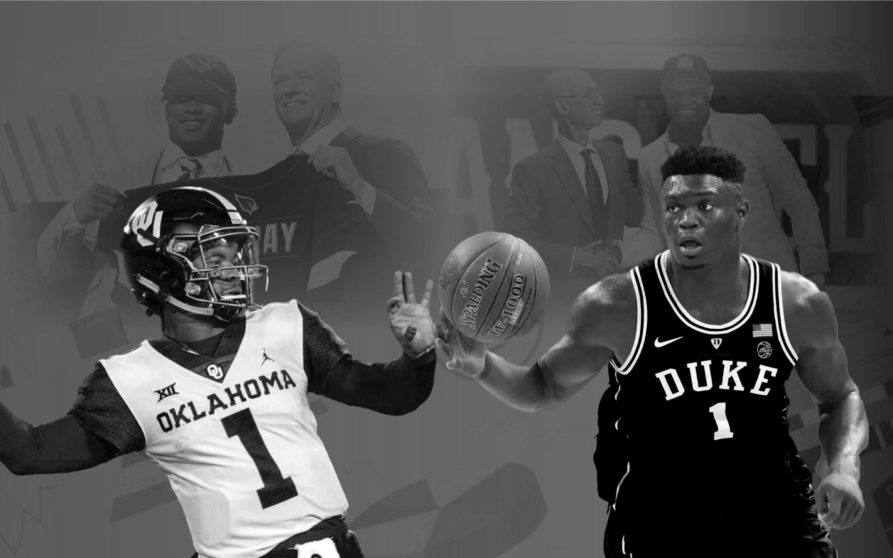

# NCAA-Machine Learning
#### -- Project status: [Active]
The app can be accessed at: https://ncaa-ml.herokuapp.com/

## Project Objective
The purpose of this project is to:

1. Visualize NCAA Basketball and Football programs across the US
2. Analyze state budgets and how they may impact sports programs
3. Build Machine Learning models that predict:
  * Which conference should you go to in order to be drafted by NBA?
  * What is the probability of you getting drafted in the NFL?
4. Host a serverless app

## Methods Used
* Extract and Transform
* Data Visualization
* Machine Learning
* Cloud

## Technologies
* Python
* Flask, Pandas, Jupyter
* PostgreSQL
* Google Colab
* Tableau
* Microsoft Azure ML
* HTML/CSS/Bootstrap
* Heroku
* AWS services: S3, RDS

## Process
* Gather data
* Read in data
* Data
   * Parse (multiple data files)
   * Map data files (implementing key relationships)
   * GeoCode Data (using Google Maps API)
* Load cleaned data into PostgreSQL connected through AWS RDS
* Create visuals using Tableau
* Construct a Machine Learning model using Microsoft Azure ML Studio
* Build a Flask app that renders our app with ML results on Heroku

## Challenges
* Initially when hosting with AWS, ran into difficulties connecting PostgreSQL to app.
* ML model request would time out on AWS when hosting.
* Building and optimizing ML models
* Web scrapping data

## Next Step
* Create a route on the app to allow user to access tables on PostgreSQL upon request.

## Data Sources
* [Sports-Reference](http://sports-reference.com/)
* [NBA Draft Combine Data](http://nbadraft.net/)
* [Athletics Budget Data](https://ope.ed.gov/athletics/#/)

## Contributing Members

**Team Leads: Salvador Olivas (https://github.com/solivas89) | Nabeel Sheikh (https://github.com/nsheikh23)**

#### Other Members:

|Name     |  Github   | 
|---------|-----------------|
|Dale Romero | https://github.com/chippen-dale |
|Dominique Dunning | https://github.com/ddunning |
